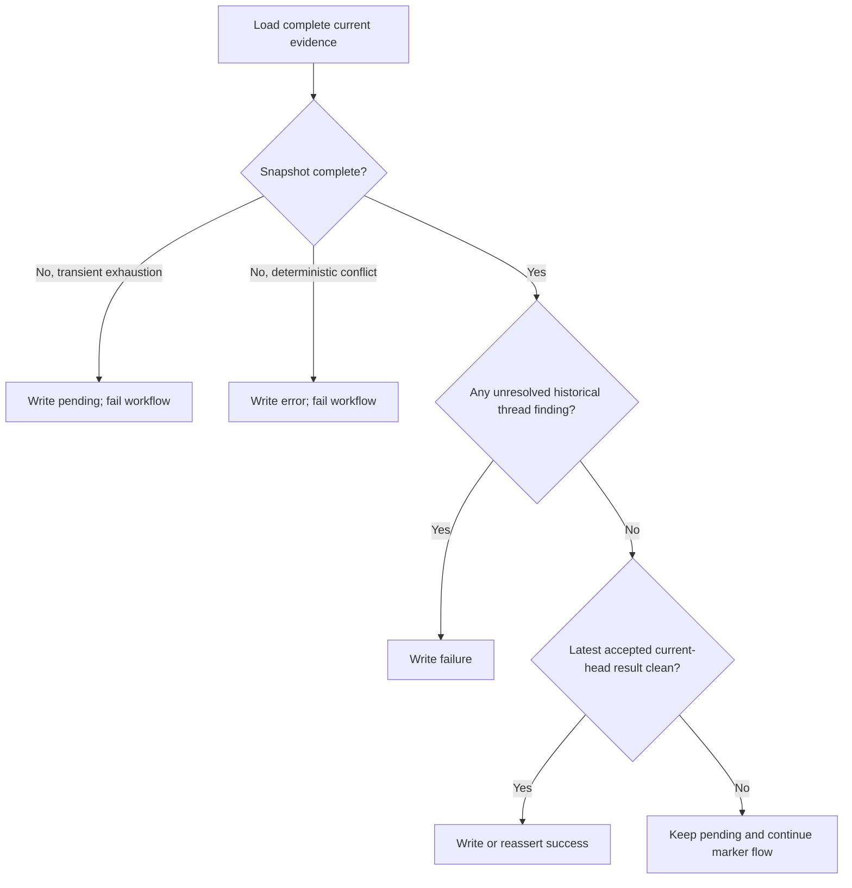
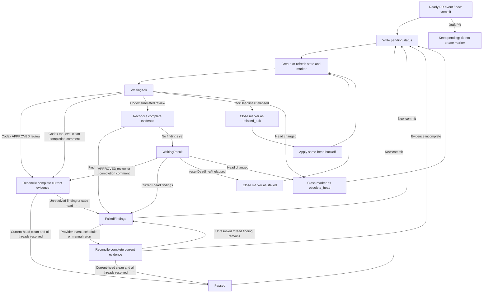

# Codex Review Gate Advanced Design

Languages: [British English (en-GB)](DESIGN.md) | [简体中文 (zh-CN)](DESIGN.zh-CN.md)

## Goal

`codex/review-gate` turns a controlled `@codex review` request into a deterministic commit status that can be required by branch protection. The gate passes only when the latest accepted Codex terminal result is clean and bound to the current PR head, and every historical thread-backed Codex finding is resolved.

## Evidence Reconciliation

Every run reconstructs the required GitHub evidence instead of treating the
sticky state comment or commit-status history as the decision source.

The result precedence is:

1. If the current evidence snapshot is incomplete after bounded retries, do not
   pass. Transient API or pagination exhaustion writes `pending`; deterministic
   provider identity, schema, or commit conflicts write `error`. Both outcomes
   fail the workflow.
2. If any historical thread-backed Codex finding is unresolved, write
   `failure`. `isOutdated` never substitutes for `isResolved`.
3. If all thread-backed findings are resolved and the latest accepted terminal
   result for the current head is clean, write `success`.
4. If no accepted clean result is available for the current head, keep the
   status `pending` while the marker workflow continues.

An older incomplete API read, pagination failure, unrecognised identity, commit
parse failure, `pending` status, or `error` status is audit history only. It
does not override a newer, complete current-head clean result. Conversely, a
newer terminal-looking provider artifact whose identity, schema, or commit
binding cannot be validated makes the current run inconclusive even if an
older accepted clean result exists.

Unthreaded top-level issue-comment findings have no GitHub resolution flag.
They remain active until a later accepted clean result for the same or a newer
head supersedes them.

Before writing `success`, the action re-reads PR lifecycle and head, the
selected terminal artifact, and the fully paginated findings snapshot. The
latest live status is read only to avoid duplicate writes. If that read fails,
the action still posts the freshly computed status; if the live status differs
from the computed status, the action reasserts the computed status.

## Generative AI Disclosure

The controlled marker comment intentionally remains a minimal `@codex review` command plus hidden gate metadata so the Codex GitHub integration can parse it reliably. When the workflow posts a controlled marker, it writes the visible disclosure to the GitHub Actions step summary instead: the workflow is requesting a Codex generative AI review, Codex may post AI-generated comments or reviews, and maintainers should verify that output before relying on it for security, correctness, or merge decisions.

The gate is event-driven. Workflow runs create markers, triage Codex signals, resume stored state, or process retry deadlines. They do not need to keep a runner active while Codex reviews the PR.

## Workflow Shape

The recommended workflow listens for:

- `pull_request_target` on `opened`, `reopened`, `ready_for_review`, and `synchronize`
- `issue_comment` on `created`
- `pull_request_review` on `submitted`
- `schedule` for automatic retry scans
- `workflow_dispatch` for manual recovery

`pull_request_review_comment` is optional. It belongs in the `full` event mode for repositories that want the fastest inline-finding triage and accept that a PR with many inline comments may trigger more workflow runs.

The workflow must run trusted default-branch action code. It must not check out or execute PR-supplied code from `pull_request_target` events.

The workflow should use one repository-wide concurrency group with `cancel-in-progress: false`. Scheduled scans can modify any open PR, so they must not run concurrently with PR-specific Codex signal runs.

## Configuration Controls

Repository and organization variables are the preferred control surface for options that should affect workflow routing before a runner starts. Runtime environment variables are accepted as compatibility input once a runner is already running.

### `CODEX_REVIEW_GATE_AUTO_RETRY`

Set this repository or organization variable to `false` to disable scheduled retry work:

```yaml
jobs:
  codex-review-gate:
    if: ${{ github.event_name != 'schedule' || vars.CODEX_REVIEW_GATE_AUTO_RETRY != 'false' }}
```

This must be a `vars` value if the intent is to avoid allocating a runner for scheduled retries. A normal workflow or job `env` value can be read by the action after the job starts, but it cannot prevent the scheduled job from being sent to a runner.

### `CODEX_REVIEW_GATE_EVENT_MODE`

`CODEX_REVIEW_GATE_EVENT_MODE` may be supplied as a repository or organization variable, or as a workflow/job environment variable. If both are supplied, the workflow should pass the most explicit runtime value to the action.

Supported modes:

- `standard`: Default. Handle Codex top-level comments and submitted pull request reviews.
- `comment-only`: Handle only Codex top-level comments as completion signals. Codex findings still block branch protection by leaving the status pending until a scheduled or manual scan evaluates them.
- `full`: Handle Codex top-level comments, submitted pull request reviews, and individual pull request review comments.

These values are exact lower-case strings so workflow-level routing and action runtime validation stay consistent.

### `CODEX_REVIEW_GATE_BOT_LOGINS`

`CODEX_REVIEW_GATE_BOT_LOGINS` may be supplied as a repository or organization variable when the Codex bot identity differs from the defaults. The sample workflow uses this `vars` value in job-level event filters so custom bot comments and reviews can wake the gate before a runner is allocated. The action also accepts the same comma-separated value through the `codex-bot-logins` input at runtime.

### `CODEX_REVIEW_GATE_COMPLETION_SIGNAL_BUFFER_SECONDS`

`CODEX_REVIEW_GATE_COMPLETION_SIGNAL_BUFFER_SECONDS` and the
`completion-signal-buffer-seconds` action input are deprecated compatibility
controls. They remain accepted in v1, but v1.3 commit-bound terminal evidence
uses exact head binding instead of a timing buffer.

`+1` reactions are diagnostic in this design. They are recorded when useful, but they are not the primary pass signal because reactions do not provide a reliable workflow wake event.

`eyes` reactions are liveness signals. The gate checks both PR-body reactions and reactions on the active marker comment. They move `WaitingAck` to `WaitingResult`, but they do not pass the gate.

### `CODEX_REVIEW_GATE_FAILED_FINDINGS_RECOVERY`

`CODEX_REVIEW_GATE_FAILED_FINDINGS_RECOVERY` may be supplied as a repository
or organization variable and passed to the action through
`failed-findings-recovery`. The runtime `FAILED_FINDINGS_RECOVERY` environment
variable is also accepted. If both are present, the action input takes
precedence. Empty or unset values default to enabled; set either value to
`false` to disable the legacy recovery branch.

This switch controls only the legacy history-based recovery branch. It does not
disable authoritative commit-bound reconciliation: the latest accepted
current-head clean result plus resolution of every historical thread-backed
finding still produces `success`, even when this compatibility switch is
`false`.

### `CODEX_REVIEW_GATE_FAILED_FINDINGS_RECOVERY_MODE`

`CODEX_REVIEW_GATE_FAILED_FINDINGS_RECOVERY_MODE`,
`failed-findings-recovery-mode`, and `FAILED_FINDINGS_RECOVERY_MODE` are
deprecated compatibility controls. `head` and `fresh` remain accepted, but
commit-bound v1.3 reconciliation evaluates the current complete evidence
snapshot and does not require a fresh provider result solely because an
earlier reconciliation saw unresolved findings.

## GHA Cost Model

The happy path normally uses two short jobs:

1. A PR event creates or refreshes state, writes `pending`, and posts a controlled `@codex review` marker for the current head.
2. A Codex top-level completion comment or `APPROVED` review wakes triage.
   The gate reloads complete evidence, verifies that the head is unchanged,
   requires every historical thread-backed finding to be resolved, and writes
   the computed status.

Finding paths depend on event mode. In `standard` mode, a Codex submitted review can wake triage and write `failure`. In `comment-only` mode, the status may stay `pending` until a scheduled or manual scan observes the findings.

The resolved-findings recovery path does not add a scheduled job or polling
loop. After a `failed_findings` status, maintainers resolve every Codex review
thread and rerun the gate through an ordinary provider event, schedule, or
`workflow_dispatch`. The short job rebuilds the normal snapshot and performs a
final validation reload before writing `success`. A previously accepted
current-head clean result remains usable; a historical incomplete run does not
force another Codex review.

The default schedule example is:

```yaml
on:
  schedule:
    - cron: "0 */2 * * *"
```

Each scheduled run scans open PRs in one job. It should skip PRs that are
draft, missing gate state, or not due for retry. A stored success or failure is
not independent proof of current readiness: when a PR is selected for
reconciliation, the action rebuilds its current evidence. Open PR count affects
API calls and wall-clock time, but it should not create one job per PR.

Approximate scheduled runner minutes:

```text
monthly_minutes ~= ceil(avg_schedule_run_seconds / 60) * runs_per_month
runs_per_month ~= 30 * 24 * 60 / cron_interval_minutes
```

For cost-sensitive private repositories, use one or more of:

- a self-hosted runner
- a less frequent schedule
- `CODEX_REVIEW_GATE_AUTO_RETRY=false`
- `CODEX_REVIEW_GATE_EVENT_MODE=comment-only`

## State Model

The gate stores one trusted sticky PR state comment with hidden JSON metadata.
This state coordinates markers, retry deadlines, audit history, and
idempotency across event runs. It is not authoritative review evidence and it
cannot by itself preserve or restore a successful gate result.

The state records:

- current tracked head SHA
- last written status state, head, and run URL for audit and idempotency
- active marker ID, URL, head SHA, created time, and attempt number
- marker baseline identities for Codex comments, reviews, and diagnostic reactions
- marker deadlines: `ackDeadlineAt`, `resultDeadlineAt`, `nextRetryAt`, `headStartedAt`, and `maxWaitDeadlineAt`
- marker state: `waiting_ack`, `waiting_result`, `passed`, `failed_findings`, `missed_ack`, `stalled`, `timed_out`, `obsolete_head`, or `state_lost`
- bounded marker history for retry backoff and recovery
- legacy failed-findings recovery fields retained for v1 compatibility

State comments and marker comments are trusted only from configured trusted authors. The default trusted author is `github-actions[bot]`, matching the repository workflow's `GITHUB_TOKEN` path.

## State Machine

The reconciliation decision precedes marker orchestration:



The following state machine coordinates request markers and retry deadlines. A
transition to `Passed` still requires the complete reconciliation above;
stored state never supplies the pass decision by itself.



```text
NoState / Passed / FailedFindings
  on ready PR event or new commit:
    write pending
    create or refresh sticky state
    close obsolete active marker if present
    create @codex review marker for current head
    create the fresh-head marker even when an older unresolved finding already blocks pass
    set ackDeadlineAt, resultDeadlineAt, nextRetryAt, headStartedAt
    -> WaitingAck

WaitingAck
  on Codex APPROVED review after marker for the same head:
    reconcile current head, latest terminal result, and all historical thread findings
    -> Passed or FailedFindings

  on Codex top-level completion comment after marker:
    reconcile current head, latest terminal result, and all historical thread findings
    -> Passed or FailedFindings

  on Codex submitted review after marker for the same head:
    reconcile the complete evidence snapshot
    -> FailedFindings if findings exist
    -> WaitingResult otherwise

  on manual, rerun, or schedule when ackDeadlineAt elapsed:
    close active marker as missed_ack
    compute exponential backoff from same-head missed_ack history
    create retry marker when nextRetryAt is due
    -> WaitingAck

WaitingResult
  on Codex APPROVED review or top-level completion comment after marker:
    reconcile current head, latest terminal result, and all historical thread findings
    -> Passed or FailedFindings

  on an unresolved Codex finding:
    write failure
    close active marker as failed_findings
    -> FailedFindings

  on manual, rerun, or schedule when resultDeadlineAt elapsed:
    close active marker as stalled
    create retry marker
    -> WaitingAck

AnyState
  on draft PR:
    keep or write pending
    do not create a new marker

  on head change:
    close active marker as obsolete_head
    write pending for latest ready head
    create marker for latest ready head
    -> WaitingAck

FailedFindings
  on a provider event, schedule, rerun, or manual dispatch:
    rebuild the complete evidence snapshot
    require every historical thread-backed finding to be resolved
    require the latest accepted terminal result to be clean and bound to the current head
    revalidate head, terminal evidence, and findings before writing
    -> Passed if all requirements remain satisfied
    -> FailedFindings if an unresolved thread-backed finding remains
    -> Pending or Error if current evidence is incomplete
```

## Signal Rules

Accepted provider evidence is channel-specific:

- REST artifacts must come from an accepted login with `user.type == "Bot"`.
  Official top-level issue comments must also have
  `performed_via_github_app.slug == "chatgpt-codex-connector"` under the
  default identity policy.
- A pull request review binds through its full `commit_id`. An inline comment
  binds through its parent review and `original_commit_id`; the mutable
  relocated inline `commit_id` is not provenance.
- A top-level clean result must match the supported clean format and carry a
  reviewed-commit marker. A short marker is resolved through the repository
  commit API and must resolve uniquely to the full current-head SHA.
- Review-body and unthreaded top-level findings bind through exact
  `https://github.com/<owner>/<repository>/blob/<40-hex>/...` links. Mixed
  repositories, commits, or unsupported current formats are not accepted.

The action fully paginates issue comments, reviews, inline comments, GraphQL
review threads, and thread comments. Missing parent reviews, thread mappings,
pages, or conflicting payload fields make the current run incomplete rather
than clean.

Thread-backed findings are historical admission evidence. A thread stops
blocking only when `isResolved` is true; `isOutdated` alone has no resolving
effect. Unthreaded findings remain active until a later accepted clean result
for the same or a newer head supersedes them.

Before writing `success`, the action reloads:

- PR lifecycle and the exact current head
- the selected latest terminal provider artifact
- the complete findings snapshot and thread resolution state

Unknown future provider formats fail the current run closed. Once a later run
can parse a complete newer current-head clean result, an older format error or
incomplete API attempt does not remain sticky.

## Fork and Dependabot PRs

GitHub documents that [PR review events other than `pull_request_target` can receive a read-only `GITHUB_TOKEN`](https://docs.github.com/en/actions/reference/workflows-and-actions/events-that-trigger-workflows#workflows-in-forked-repositories) for fork and Dependabot PRs, and Dependabot-triggered `pull_request_target`, review, and comment events can also run with a read-only token. The sample workflow therefore filters Dependabot event wakeups before runner allocation, and the action skips the same write path defensively if a user workflow omits that filter.

Fork PR review events are opportunistic: if the current PR head is from a fork, the action skips `pull_request_review` and `pull_request_review_comment` writes and relies on top-level `issue_comment`, schedule, or manual recovery. Dependabot PRs rely on schedule or manual recovery for all write-capable progress. Scheduled scans may initialise a Dependabot PR with no prior gate state because the per-event wakeups are intentionally ignored.

## Retry and Recovery

`workflow_dispatch` may target one PR or scan open PRs. A rerun should behave like a resume operation: reload the current PR state from GitHub, ignore stale event head assumptions, and advance the state machine only from current evidence.

If the sticky state comment is missing but a trusted marker comment exists, the gate must recover safely:

1. Record the recovered marker as `state_lost`.
2. Baseline currently visible Codex signals.
3. Do not pass from the recovered marker.
4. Create a fresh marker or fail from an unresolved finding.

If the sticky state comment exists but marker creation failed before a marker comment was persisted, scheduled recovery treats the current-head pending state as needing a fresh marker. The same retry rule applies after a marker is closed as `missed_ack` or `stalled` but posting the replacement marker fails.

Scheduled runs process retry deadlines. They should scan open PRs, load state only for candidate PRs, and advance markers whose `nextRetryAt`, `ackDeadlineAt`, or `resultDeadlineAt` has elapsed.

If a current reconciliation exhausts bounded retries for a transient API or
pagination failure, the gate writes `pending` to that PR head and fails the
workflow. A deterministic provider identity, schema, or commit conflict writes
`error` and fails the workflow. These states describe the current run only;
they do not prevent a later complete reconciliation from writing `success`.

Consecutive `missed_ack` outcomes on the same head use exponential backoff. A head change or any non-`missed_ack` outcome resets that ack backoff history for the new marker.

After `failed_findings`, maintainers resolve every Codex review thread and
rerun through an ordinary provider event, schedule, or `workflow_dispatch`.
A previously accepted current-head clean result can be reconciled again after
the threads are resolved, regardless of the legacy recovery switch. An earlier
incomplete run does not require a new Codex review. If the current
reconciliation is still incomplete, it remains non-success until a complete
run succeeds.

## Branch Protection

Repository rulesets should require:

- the `codex/review-gate` status check
- GitHub's native conversation-resolution protection, when the repository wants unresolved inline conversations to block merges

The status check requires both a clean current-head Codex terminal result and
resolution of every historical thread-backed Codex finding. Native conversation
resolution remains useful as an independent UI and branch-protection signal.
