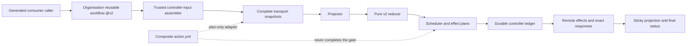

# Codex Review Gate v2 Design

Languages: [British English (en-GB)](DESIGN.md) | [简体中文 (zh-CN)](DESIGN.zh-CN.md)

## Goal and activation state

V2 turns one sealed Codex provider-evidence snapshot into a closed decision,
then lets a trusted controller perform the authorised request, status, and
sticky-projection effects in a durable order. The public status context is
`codex/github-review-gate`.

The public trust boundary is the organisation reusable workflow:

```yaml
uses: Joey-Tools/codex-review-gate-action/.github/workflows/codex-review-gate.yml@v2
```

`@v2` is a release alias over an immutable signed v2 commit. The called job
materialises the exact selected workflow repository and object. This is a
centralised compatible-major delegation, not permission to execute arbitrary
code from a consumer repository.

Production activation remains blocked. The trusted production controller-input
assembler, durable scheduled dispatcher, and automatic effect protocol are
implemented and locally gated; publication admission and live activation proof
remain P0 prerequisites. The current package documents a completed local
implementation boundary, not a supported required-check rollout. Missing
release, environment, server-time, or canary evidence fails closed.

## Architecture



The production assembler converts each trusted event, scan, observation
boundary, and durable history into the exact controller command. The
package-local reconcile workflow is a template/contract fixture for this shape,
not a hosted central router and not activation evidence.

## Trust boundaries

### Consumer boundary

The consumer owns only its generated caller, permission ceiling, and the
organisation `@v2` call. A called workflow cannot elevate `GITHUB_TOKEN`.
Consumer PR code, checkout files, and caller-supplied arbitrary JSON are not
trusted controller inputs.

### Release boundary

The release pipeline publishes the complete `packages/action` subtree to
`Joey-Tools/codex-review-gate-action`. The personal
`JoeyTeng/codex-review-gate-action` repository is a frozen v1 archive. V2
documentation, runtime identity, and release aliases never select it.

The selected reusable workflow checks out:

- `repository: ${{ job.workflow_repository }}`
- `ref: ${{ job.workflow_sha }}`
- `persist-credentials: false`

The exact selected object is the runtime source for that invocation. The
floating major alias permits compatible v2 releases; the immutable release
commit and signed tags are established by release policy, not by a caller
claim.

### Controller boundary

The trusted controller owns:

- canonical input construction and state reconstruction;
- complete read transport and bounded final reread;
- durable request reservations and effect ledger persistence;
- effect ordering and retry-zero enforcement;
- response validation and binding;
- sticky projection and commit-status publication;
- server-time-bound wait transitions.

The reducer and plan adapter cannot grant these capabilities to themselves.

### Provider-evidence boundary

Events and wakeup hints are observation triggers only. Request comments,
terminal provider artefacts, findings, reactions, thread state, no-start
responses, and lifecycle data are admitted only after complete transport,
closed-schema projection, and stability checks. A commit status, generic bot
creator, sticky comment, scheduler deadline, or prior decision is not provider
evidence.

## Plan-only composite adapter

`action.yml` executes `src/v2/action.mjs`. It accepts an operation input path
under `RUNNER_TEMP`, validates that the path is controller-owned rather than
checkout/PR-controlled, performs read-only transport, and returns closed plans.

Its operations are `prepare-request`, `bind-request`, and `evaluate-only`.
Its required, no-default status target enum is `head` or
`test-merge-with-head-sentinel`. `head` authorizes only non-success sentinel
writes; clean/skipped status publication is explicitly suppressed. Every
terminal verdict is publishable only to a validated potential merge. The
Joey-Tools production reusable workflow hardcodes
`test-merge-with-head-sentinel` and exposes no selector for it.

The adapter explicitly rejects non-read GitHub transport and any runner result
that claims performed writes. It does not:

- create `@codex review` comments;
- write pending, success, failure, or error statuses;
- persist a scheduler intent or effect ledger;
- bind a remote response as an executed effect;
- perform an environment wait;
- publish a sticky state projection;
- complete branch protection.

Therefore direct composite use, including an exact-SHA invocation, is a
low-level controller-development interface only. Plan files are not effect
receipts. A controller that consumes them must independently preserve the
closed schemas, durability, ordering, idempotency, and response-binding
contracts.

## Projection and reduction

The projector joins immutable discovery and exact-evidence snapshots with
explicit controller state. It binds the repository, pull request, base, head,
unique merge base, potential merge commit/tree/parents, lifecycle, selection,
server enforcement, requests, provider artefacts, thread resolution,
acknowledgements, no-start observations, and inventory completeness.

Selection is available only through explicit v2 controller intent or compatible
v2 server enforcement. There is no filesystem, tag-name, legacy-file, or
decision-table heuristic that selects a policy major.

The reducer is pure: it has no I/O, clock, or environment dependency. It
accepts only the closed schema and returns one of:

- `not-selected`
- `pending`
- `clean`
- `findings`
- `inconclusive`
- `skipped-unavailable`
- `blocked-configuration`
- `blocked-input`

Key precedence rules are:

1. Disabled or ineligible v2 selection is `not-selected`.
2. An invalid/currently unbound review epoch is `blocked-input`.
3. Missing compatible workflow/ruleset/App enforcement is
   `blocked-configuration`.
4. A trustworthy blocking finding is `findings`, even if another inventory is
   incomplete.
5. Unstable scope, incomplete pagination/final reread, malformed or unstable
   evidence, or exhausted request authority is `inconclusive`.
6. A confirmed no-start response is `skipped-unavailable` only for implicit
   selection; an explicitly requested route is blocked instead.
7. `clean` requires complete stable evidence and an admitted terminal clean or
   accepted closed reaction basis.
8. Otherwise the selected current epoch remains `pending`.

Positive completion is deliberately stricter than negative evidence. A
finding may block from a trustworthy carrier even when unrelated acquisition
is incomplete; clean never arises from a partial snapshot.

## Review epoch and status targets

One v2 review epoch binds repository and PR identity plus exact base, head,
merge base, and ordered potential-merge data. Lifecycle must remain open.
Initial and final scope projections must match before positive completion.

The primary terminal policy targets the test-merge commit. Where required, the
controller also writes a head sentinel so a stale or mismatched merge result
cannot silently satisfy a head-only rule. Target choice is a closed scheduler
mode, not a consumer-defined SHA.

Commit Status remains keyed by repository SHA and context. It is not a
cryptographic attestation, provider artefact, or PR-isolation proof. V2 relies
on controller receipts, exact epoch binding, complete provider reduction, and
final reread rather than creator/context appearance alone.

## Scheduling and public waits

The scheduler computes effects without sleeping or performing I/O. It returns
closed actions, `due-at`, and `wakeup-hints`; these are advisory scheduling
state, never evidence or verdicts.

The repository schedule has a separate durable dispatch protocol. A coordinator
completes or resumes the protected candidate inventory, proves the full-cycle
record and byte budget, persists one active reservation, and only then projects
up to 64 canonical matrix rows. Scheduled rows execute serially and must present
the original dispatch binding. The ledger enforces one attempt per candidate,
requires the complete acquire/effect/release authority before acknowledgement,
and records batch/cycle completion. Restart completes partial bookkeeping or
exposes a typed recovery state; it never lists an attempted candidate again.

Public routes require three distinct 15-minute environment boundaries:

- `codex-review-gate-public-initial-15m`
- `codex-review-gate-public-post-request-15m`
- `codex-review-gate-public-no-start-15m`

Each environment must have an exact 15-minute wait-timer protection rule. Its
name alone provides no assurance. A trusted API preflight and live canary must
prove the rules, and the controller must validate server-time observations so
an early release cannot authorise an effect. A shell sleep, delayed cron, or
immediate workflow rerun is not an equivalent boundary.

Manual dispatch is `evaluate-only`: it may evaluate but cannot request a
review or publish a status. Provider events are hints to rebuild the snapshot;
they do not directly carry a trusted decision.

## Durable effect ordering

The controller effect ledger is scoped to repository, PR, and head. Each effect
has an identity and idempotency key and moves through a persist-before-effect
protocol.

For review requests:

1. reserve the scheduler request;
2. persist the retry-zero intent;
3. persist the pre-effect attempt;
4. perform exactly one request POST;
5. bind the exact 201 response;
6. rebuild/reduce the subsequent snapshot;
7. publish only controller-authorised status and sticky effects.

An attempted effect with an ambiguous response is never reclaimed or replayed.
Later invocations may reuse an already bound response but cannot create a
second effect for the same idempotency key. Status and sticky effects follow
the same reserve, persist, perform, and bind discipline.

This provides durable causal ordering, not distributed atomicity. If
persistence or response binding cannot be proved, the controller stops closed
and retains the ledger for recovery.

## Server enforcement and activation

V2 selection is meaningful only when the trusted controller and required
server-side workflow/ruleset/App bindings are compatible. The reducer exposes
that distinction as selection and server-enforcement status instead of
inferring readiness from a workflow file in a branch.

Production activation requires all of these properties simultaneously:

- the admitted release contains the reviewed assembler, durable dispatch, and
  effect protocol and matches the locally gated tree;
- the organisation reusable workflow at `@v2` is the selected public entry;
- all environment wait rules pass trusted API preflight;
- a live canary proves wait and server-time enforcement;
- controller concurrency and durable ledger scope are correct;
- the exact status target/sentinel behaviour is proven;
- the final snapshot and effect receipts remain stable;
- only then is `codex/github-review-gate` added to the ruleset.

Until then, the supported state is pre-activation validation. A copied caller,
package-local reconcile fixture, green adapter run, or locally constructed
controller JSON cannot satisfy this gate.

## Major isolation and retained v1 artefacts

The release tree retains the v1 implementation and decision documents to
preserve history and the frozen archive:

- `src/core.mjs` and `src/gate.mjs` are legacy v1 runtime files;
- `decision-table.json` remains authoritative only for v1 policy major 1;
- `producer-receipt.schema.json` describes legacy producer receipt v1;
- personal-repository `@v1` references remain frozen v1 consumers.

These files are deliberately unselected in v2. The v2 projector, reducer,
scheduler, plan adapter, and workflow controller import their own `src/v2`
modules and closed schemas. The v2 controller has no option, environment
variable, tag fallback, error recovery, or compatibility route that selects
the v1 reducer. A v2 failure remains `blocked-*`, `inconclusive`, or another
closed v2 outcome.

The organisation v2 target must expose no `v1*` branch or tag selector. File
presence in the split history does not create selection authority. This
major-isolated retention permits audit and archive continuity without making
v1 a downgrade path.

## Security non-guarantees

V2 does not claim that:

- a floating major alias is post-run immutable provenance;
- `github-actions[bot]` proves which workflow code ran;
- a commit status alone proves provider evidence or PR isolation;
- environment names prove their protection rules;
- the composite adapter executes its plans;
- a plan/result digest is a signature or remote-effect receipt;
- one point-in-time reread eliminates all TOCTOU risk;
- retained v1 files are selectable by v2.

The design instead uses explicit release selection, closed schemas, complete
snapshots, stable rereads, durable effect identities, response binding, and
fail-closed activation evidence.
