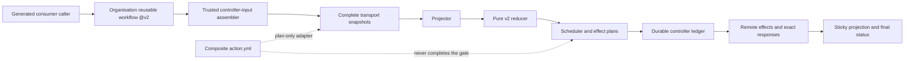

# Codex Review Gate v2 Design

Languages: [British English (en-GB)](DESIGN.md) | [简体中文 (zh-CN)](DESIGN.zh-CN.md)

## Goal and activation state

V2 turns one sealed Codex provider-evidence snapshot into a closed decision,
then lets a trusted controller perform the authorised request, status, and
sticky-projection effects in a durable order. The public status context is
`codex/github-review-gate`.

The public trust boundary is the organisation reusable workflow:

```yaml
uses: Joey-Tools/codex-review-gate-action/.github/workflows/codex-review-gate.yml@v2
```

`@v2` is a release alias over an immutable signed v2 commit. The called job
materialises the exact selected workflow repository and object. This is a
centralised compatible-major delegation, not permission to execute arbitrary
code from a consumer repository.

Production activation remains blocked. The trusted production controller-input
assembler, durable scheduled dispatcher, and automatic effect protocol are
implemented and locally gated; publication admission and live activation proof
remain P0 prerequisites. The current package documents a completed local
implementation boundary, not a supported required-check rollout. Missing
release, environment, server-time, or canary evidence fails closed.

## Architecture



The production assembler converts each trusted event, scan, observation
boundary, and durable history into the exact controller command. The
package-local reconcile workflow is a template/contract fixture for this shape,
not a hosted central router and not activation evidence.

## Trust boundaries

### Consumer boundary

The consumer owns only its generated caller, permission ceiling, and the
organisation `@v2` call. A called workflow cannot elevate `GITHUB_TOKEN`.
Consumer PR code, checkout files, and caller-supplied arbitrary JSON are not
trusted controller inputs.

### Release boundary

The release pipeline publishes the complete `packages/action` subtree to
`Joey-Tools/codex-review-gate-action`. The personal
`JoeyTeng/codex-review-gate-action` repository is a frozen v1 archive. V2
documentation, runtime identity, and release aliases never select it.

The selected reusable workflow checks out:

- `repository: ${{ job.workflow_repository }}`
- `ref: ${{ job.workflow_sha }}`
- `persist-credentials: false`

The exact selected object is the runtime source for that invocation. The
floating major alias permits compatible v2 releases; the immutable release
commit and signed tags are established by release policy, not by a caller
claim.

### Controller boundary

The trusted controller owns:

- canonical input construction and state reconstruction;
- complete read transport and bounded final reread;
- durable request reservations and effect ledger persistence;
- effect ordering and retry-zero enforcement;
- response validation and binding;
- sticky projection and commit-status publication;
- server-time-bound wait transitions.

The reducer and plan adapter cannot grant these capabilities to themselves.

### Provider-evidence boundary

Events and wakeup hints are observation triggers only. Request comments,
terminal provider artefacts, findings, reactions, thread state, no-start
responses, and lifecycle data are admitted only after complete transport,
closed-schema projection, and stability checks. A commit status, generic bot
creator, sticky comment, scheduler deadline, or prior decision is not provider
evidence.

## Plan-only composite adapter

`action.yml` executes `src/v2/action.mjs`. It accepts an operation input path
under `RUNNER_TEMP`, confines the read to the selected `RUNNER_TEMP` directory
object rather than a checkout/PR-controlled path, performs read-only transport,
and returns closed plans.

On Linux and macOS, the reader holds the selected `RUNNER_TEMP` directory open
while one isolated child walks from `/`. Each directory component is opened
without following the leaf, held across `chdir`, and compared by device, inode,
and file type before traversal continues. The leaf is opened nonblocking and
without following it in the parent and remains held as inherited descriptor 4.
The child reads only that selected descriptor and requires the relative leaf to
match its device, inode, file type, access policy, and selected size both before
and after the two positioned reads. The stable bytes must also be strict UTF-8
and the unique canonical JSON representation. This protects against redirection
to a different directory or leaf object; it does not prove producer provenance
or that a race-time symlink resolving to the same object was never traversed.
It also assumes no privileged bind-mount, mount-namespace, or filesystem
identity-semantic attack; those require native mount-aware APIs. Other platforms
fail closed.

At each observed leaf stat, the access-policy predicate is exactly: regular
file, link count one, and POSIX group/other write mode bits clear. It does not
inspect extended ACLs and does not establish protection from a same-UID writer,
owner provenance, or privileged mount authority; those are outside the fixed
Ubuntu production threat model.

Its operations are `prepare-request`, `bind-request`, and `evaluate-only`.
Its required, no-default status target enum is `head` or
`test-merge-with-head-sentinel`. `head` authorizes only non-success sentinel
writes; clean/skipped status publication is explicitly suppressed. Every
terminal verdict is publishable only to a validated potential merge. The
Joey-Tools production reusable workflow hardcodes
`test-merge-with-head-sentinel` and exposes no selector for it.

The adapter explicitly rejects non-read GitHub transport and any runner result
that claims performed writes. It does not:

- create `@codex review` comments;
- write pending, success, failure, or error statuses;
- persist a scheduler intent or effect ledger;
- bind a remote response as an executed effect;
- perform an environment wait;
- publish a sticky state projection;
- complete branch protection.

Therefore direct composite use, including an exact-SHA invocation, is a
low-level controller-development interface only. Plan files are not effect
receipts. A controller that consumes them must independently preserve the
closed schemas, durability, ordering, idempotency, and response-binding
contracts.

## Projection and reduction

The projector joins immutable discovery and exact-evidence snapshots with
explicit controller state. It binds the repository, pull request, base, head,
unique merge base, potential merge commit/tree/parents, lifecycle, selection,
server enforcement, requests, provider artefacts, thread resolution,
acknowledgements, no-start observations, and inventory completeness.

Selection is available only through explicit v2 controller intent or compatible
v2 server enforcement. There is no filesystem, tag-name, legacy-file, or
decision-table heuristic that selects a policy major.

The reducer is pure: it has no I/O, clock, or environment dependency. It
accepts only the closed schema and returns one of:

- `not-selected`
- `pending`
- `clean`
- `findings`
- `inconclusive`
- `skipped-unavailable`
- `blocked-configuration`
- `blocked-input`

Key precedence rules are:

1. Disabled or ineligible v2 selection is `not-selected`.
2. An invalid/currently unbound review epoch is `blocked-input`.
3. Missing compatible workflow/ruleset/App enforcement is
   `blocked-configuration`.
4. A trustworthy blocking finding is `findings`, even if another inventory is
   incomplete.
5. Unstable scope, incomplete pagination/final reread, malformed or unstable
   evidence, or exhausted request authority is `inconclusive`.
6. A confirmed no-start response is `skipped-unavailable` only for implicit
   selection; an explicitly requested route is blocked instead.
7. `clean` requires complete stable evidence and an accepted closed reaction
   basis. A terminal clean classifies the provider artifact but is not positive
   completion authority.
8. Otherwise the selected current epoch remains `pending`.

Positive completion is deliberately stricter than negative evidence. A
finding may block from a trustworthy carrier even when unrelated acquisition
is incomplete; clean never arises from a partial snapshot.

Reaction-only clean selects the unique latest eligible request and its exact
provider `+1`. An exact-provider `eyes` reaction at the same or a later
semantic time vetoes that reaction-only result; an earlier `eyes` reaction does
not. Reactions never override a selected terminal payload, including in the
`mixed` profile.

## Review epoch and status targets

One v2 review epoch binds repository and PR identity plus exact base, head,
merge base, and ordered potential-merge data. Lifecycle must remain open.
Initial and final scope projections must match before positive completion.

Request quotas and automatic generation continuity remain head-scoped across a
base retarget, so an older generation is never hidden or refunded. Positive
`+1` and no-start authority are narrower: they must bind the latest admitted
head generation, and that request must also match the current base and head.
An earlier-base request can therefore support the next recovery generation or
retain negative finding history, but it cannot authorize the current review
epoch after the test-merge input changes. A stable current-head terminal clean
may still classify the published artifact, but no accepted provider schema
binds that carrier to a request, run, or input base.

Durable controller history is partitioned deliberately. Only
`automatic-request-reservation` intents and `review-request`,
`request-binding`, `artifact-binding`, and `scheduler-state` responses survive
a same-PR, same-head base or potential-merge retarget. Status and sentinel
bindings, no-start and thread-resolution observations, and control/sticky
comment bindings remain exact-current and are read only from the current
incarnation: the exact-scope suffix after the latest durable same-head record
from another base or potential merge. This prevents an A-to-B-to-A retarget
from reviving A's earlier scheduler, status, sentinel, no-start, or comment
authority. Retained earlier-base history preserves budget, generation,
retry-zero, recovery, and negative-finding continuity, but cannot become
current positive authority. An automatic reservation defines its generation
origin. Its later review-request and request-binding records reference that
origin even when a same-head retarget moves the request operation into a new
exact scope; a manual request binding defines its own generation because it has
no reservation. Artifact-binding and scheduler-state records likewise
reference an existing origin and never redefine it from their current
operation scope.

Partial transactions obey the same split. A head-scoped reservation that has
not reached its retry-zero attempt remains charged after a retarget, while the
recovered attempt and request binding must bind the new exact scope and its
scheduler observation. An unanswered artifact-binding intent is exact-current
and current-incarnation: an intent from an old scope, or from an earlier visit
to the same exact tuple separated by a durable foreign-scope record, is
quarantined rather than compared with or replayed as the current candidate.
The stable incarnation anchor is the latest durable same-head foreign-scope
record; it participates in the effect identity, while a crash or lease change
inside one incarnation resumes the same transaction.

The control-plane audit receipt is schema version 2. Its serialized validator
also accepts the exact closed legacy version-1 shape for audit compatibility,
but deserialization never recreates the process-local authority handle. Version
2 marks request bindings with `current_incarnation`, requires the true markers
to form one ledger suffix, and joins each current binding to its exact current
generation. A visible request comment from an earlier head must still have a
durable audit binding, but it is excluded from exact selectors, projected
requests, and reactions. A visible current-head request without a binding fails
closed.

The legacy version-1 receipt retains its original request-binding ceiling of
three automatic plus sixty-four manual bindings. Sticky schema-version-1
projections recognize the exact historical `terminal-clean`,
`terminal-findings`, `malformed-evidence`, and `unresolved-inline-finding`
whole-PR scope profiles for audit and continuation compatibility only; current
snapshots still require their current scope assurance.

An address command that uniquely targets an exact-refetched, closed-provider
finding carrier excluded solely because it belongs to an earlier head is
historical and is ignored. Unknown targets, non-canonical or misbound URLs,
ambiguous carriers, and invalid current-head targets still fail closed. Likewise,
provider reactions from an earlier incarnation or before the selected current
request do not suppress a valid current no-start result. Only exact-provider
activity bound to that selected request at or after its request time is a
no-start disqualifier.

Serialized receipts retain record OIDs, payload digests, response times, and
other audit pointers. The generic projector surface exposes only fields that
the closed receipt can independently join or that the branded live-ledger path
authorizes; it deliberately omits source-row pointers that a deserialized
manifest digest cannot independently revalidate. Closed generation admissions
are the exception only where the receipt proves the prior-binding,
recovery-transition, and next-binding order and identities together.

Control-comment create/update history alone is not prior runner scheduling
state. The first scheduler observation after such a comment-only predecessor
still requires the same-load initial runner authority; after that observation
and its status transaction, later scheduling requires established authority.

A stable, final-reread current-head terminal clean is classification-only. It
produces `inconclusive` with a `terminal-payload` (or `mixed`) profile and an
exact `artifact-publication-only` artifact basis. Its selected request,
generation, and recovery fields remain null, and a reaction cannot override the
terminal classification. The runner exposes no terminal-clean binding
candidate, the ledger admits no new terminal-clean completion transaction, and
the projector never manufactures request lineage for such a carrier. Exact
rich carrier commitments remain useful for findings and audit integrity, while
legacy two-field bindings remain findings-only.

Conversely, a completing current-request reaction binds its selected request
and has no selected artifact. A non-null finding-recovery receipt is valid only
on that reaction basis. Stable input blockers map only to `blocked-input`; they
cannot manufacture `blocked-configuration`.

Finding recovery remains stricter: after the prior finding is proved closed and
a causally later current request generation is admitted, only a later reaction
on that current request may complete clean. A terminal-clean carrier cannot
supply or replace this recovery step. The completing request may be a manual
generation when automatic quota is exhausted; automatic-to-automatic recovery
still requires the strictly increasing closed generation chain.

The ledger candidate-authority compatibility boundary therefore remains
findings-only: schema version 1 retains its original byte and digest identity
for `finding-recovery` / `findings` in automatic generations 1 and 2, and no
version may turn an unauthenticated terminal clean into completion authority.
Any historical terminal-clean-shaped record is audit-only and cannot be
continued or projected as positive evidence. The closed parser may recognize
its bytes, but durable replay rejects the terminal-clean binding purpose before
any scheduler or generation lineage could authorize it.

The pre-activation B boundary still makes production effects unreachable.
Local proof composes the real runner, protected ledger transactions, fresh
control-plane receipt, projector, reducer, and controller ordering without
inventing a positive terminal-clean route. It is not activation evidence.

The primary terminal policy targets the test-merge commit. Where required, the
controller also writes a head sentinel so a stale or mismatched merge result
cannot silently satisfy a head-only rule. Target choice is a closed scheduler
mode, not a consumer-defined SHA. When no potential merge is validated,
`not-selected` and configuration-blocked results retain a null primary target;
they do not substitute the head commit for a missing test-merge target.

Commit Status remains keyed by repository SHA and context. It is not a
cryptographic attestation, provider artefact, or PR-isolation proof. V2 relies
on controller receipts, exact epoch binding, complete provider reduction, and
final reread rather than creator/context appearance alone.

## Scheduling and public waits

The scheduler computes effects without sleeping or performing I/O. It returns
closed actions, `due-at`, and `wakeup-hints`; these are advisory scheduling
state, never evidence or verdicts.

The repository schedule has a separate durable dispatch protocol. A coordinator
completes or resumes the protected candidate inventory, proves the full-cycle
record and byte budget, persists one active reservation, and only then projects
up to 64 canonical matrix rows. Scheduled rows execute serially and must present
the original dispatch binding. The ledger enforces one attempt per candidate,
requires the complete acquire/effect/release authority before acknowledgement,
and records batch/cycle completion. Restart completes partial bookkeeping or
exposes a typed recovery state; it never lists an attempted candidate again.

Public routes require three distinct 15-minute environment boundaries:

- `codex-review-gate-public-initial-15m`
- `codex-review-gate-public-post-request-15m`
- `codex-review-gate-public-no-start-15m`

Each environment must have an exact 15-minute wait-timer protection rule. Its
name alone provides no assurance. A trusted API preflight and live canary must
prove the rules, and the controller must validate server-time observations so
an early release cannot authorise an effect. A shell sleep, delayed cron, or
immediate workflow rerun is not an equivalent boundary.

Manual dispatch is `evaluate-only`: it may evaluate but cannot request a
review or publish a status. Provider events are hints to rebuild the snapshot;
they do not directly carry a trusted decision.

## Durable effect ordering

The controller effect ledger is scoped to repository, PR, and head. Each effect
has an identity and idempotency key and moves through a persist-before-effect
protocol.

For review requests:

1. reserve the scheduler request;
2. complete the exact safe pre-scope read;
3. persist the pre-effect attempt;
4. persist the retry-zero request intent;
5. perform exactly one request POST;
6. bind the exact 201 response;
7. rebuild/reduce the subsequent snapshot;
8. publish only controller-authorised status and sticky effects.

An attempted effect with an ambiguous response is never reclaimed or replayed.
A pre-scope read failure leaves neither a pre-effect attempt nor a retry-zero
request intent, and remains retryable without claiming that a POST happened.
Later invocations may reuse an already bound response but cannot create a second
effect for the same idempotency key. Status and sticky effects follow the same
reserve, persist, perform, and bind discipline.

The trusted server-time chain is ordered as `pre-scope <= pre-effect attempt <=
retry-zero request intent <= request created_at <= POST response <= exact
refetch <= post-scope`. The request-intent boundary therefore proves
write-ahead persistence before the public POST; it must not be misused as a
lower bound on the earlier pre-scope observation.

This provides durable causal ordering, not distributed atomicity. If
persistence or response binding cannot be proved, the controller stops closed
and retains the ledger for recovery.

## Server enforcement and activation

V2 selection is meaningful only when the trusted controller and required
server-side workflow/ruleset/App bindings are compatible. The reducer exposes
that distinction as selection and server-enforcement status instead of
inferring readiness from a workflow file in a branch.

Production activation requires all of these properties simultaneously:

- the admitted release contains the reviewed assembler, durable dispatch, and
  effect protocol and matches the locally gated tree;
- the organisation reusable workflow at `@v2` is the selected public entry;
- all environment wait rules pass trusted API preflight;
- a live canary proves wait and server-time enforcement;
- controller concurrency and durable ledger scope are correct;
- the exact status target/sentinel behaviour is proven;
- the final snapshot and effect receipts remain stable;
- only then is `codex/github-review-gate` added to the ruleset.

Until then, the supported state is pre-activation validation. A copied caller,
package-local reconcile fixture, green adapter run, or locally constructed
controller JSON cannot satisfy this gate.

## Major isolation and retained v1 artefacts

The release tree retains the v1 implementation and decision documents to
preserve history and the frozen archive:

- `src/core.mjs` and `src/gate.mjs` are legacy v1 runtime files;
- `decision-table.json` remains authoritative only for v1 policy major 1;
- `producer-receipt.schema.json` describes legacy producer receipt v1;
- personal-repository `@v1` references remain frozen v1 consumers.

These files are deliberately unselected in v2. The v2 projector, reducer,
scheduler, plan adapter, and workflow controller import their own `src/v2`
modules and closed schemas. The v2 controller has no option, environment
variable, tag fallback, error recovery, or compatibility route that selects
the v1 reducer. A v2 failure remains `blocked-*`, `inconclusive`, or another
closed v2 outcome.

The organisation v2 target must expose no `v1*` branch or tag selector. File
presence in the split history does not create selection authority. This
major-isolated retention permits audit and archive continuity without making
v1 a downgrade path.

## Security non-guarantees

V2 does not claim that:

- a floating major alias is post-run immutable provenance;
- `github-actions[bot]` proves which workflow code ran;
- a commit status alone proves provider evidence or PR isolation;
- environment names prove their protection rules;
- the composite adapter executes its plans;
- a plan/result digest is a signature or remote-effect receipt;
- one point-in-time reread eliminates all TOCTOU risk;
- retained v1 files are selectable by v2.

The design instead uses explicit release selection, closed schemas, complete
snapshots, stable rereads, durable effect identities, response binding, and
fail-closed activation evidence.
