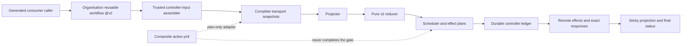

# Codex Review Gate v2 Design

语言：[British English (en-GB)](DESIGN.md) | [简体中文 (zh-CN)](DESIGN.zh-CN.md)

## 目标和 activation 状态

V2 把一份 sealed Codex provider-evidence snapshot 归并为 closed decision，再由 trusted
controller 按 durable order 执行已授权的 request、status 和 sticky-projection effect。
公开 status context 是 `codex/github-review-gate`。

公开 trust boundary 是 organization reusable workflow：

```yaml
uses: Joey-Tools/codex-review-gate-action/.github/workflows/codex-review-gate.yml@v2
```

`@v2` 是指向 immutable signed v2 commit 的 release alias。Called job materialize 精确
selected workflow repository/object。这是 compatible-major 的集中式委托，不允许执行
consumer repository 中的任意 code。

Production activation 仍为 blocked。Trusted production controller-input assembler、
durable scheduled dispatcher 与 automatic effect protocol 已实现并通过本地门禁；
publication admission 和 live activation proof 仍是 P0 前置条件。因此当前 package
记录的是完整 local implementation boundary，不提供 supported required-check rollout。
缺少 release、environment、server-time 或 canary evidence 时必须 fail closed。

## 架构



Production assembler 把每个 trusted event、scan、observation boundary 和 durable
history 转换成精确 controller command。Package-local reconcile workflow 只是这个
形状的 template/contract fixture，不是 hosted central router，也不是 activation evidence。

## Trust boundary

### Consumer boundary

Consumer 只拥有 generated caller、permission ceiling 和 organization `@v2` call。
Called workflow 不能提升 `GITHUB_TOKEN`。Consumer PR code、checkout file 和
caller-supplied arbitrary JSON 不是 trusted controller input。

### Release boundary

Release pipeline 把完整 `packages/action` subtree 发布到
`Joey-Tools/codex-review-gate-action`。个人 `JoeyTeng/codex-review-gate-action`
repository 是 frozen v1 archive；v2 documentation、runtime identity 和 release alias
绝不选择它。

Selected reusable workflow checkout：

- `repository: ${{ job.workflow_repository }}`
- `ref: ${{ job.workflow_sha }}`
- `persist-credentials: false`

精确 selected object 是该 invocation 的 runtime source。Floating major alias 允许
compatible v2 release；immutable release commit 和 signed tag 来自 release policy，
不是 caller claim。

### Controller boundary

Trusted controller 拥有：

- canonical input construction 和 state reconstruction；
- complete read transport 和 bounded final reread；
- durable request reservation 和 effect ledger persistence；
- effect ordering 和 retry-zero enforcement；
- response validation/binding；
- sticky projection 和 commit-status publication；
- server-time-bound wait transition。

Reducer 和 plan adapter 无法自行获得这些 capability。

### Provider-evidence boundary

Event 和 wakeup hint 只是 observation trigger。Request comment、terminal provider
artefact、finding、reaction、thread state、no-start response 和 lifecycle data 只有经过
complete transport、closed-schema projection 和 stability check 后才可使用。Commit
status、generic bot creator、sticky comment、scheduler deadline 或 prior decision 都不是
provider evidence。

## Plan-only composite adapter

`action.yml` 执行 `src/v2/action.mjs`。它接受 `RUNNER_TEMP` 下的 operation input path，
验证该 path 是 controller-owned 而非 checkout/PR-controlled，执行 read-only transport，
再返回 closed plan。

Operations 是 `prepare-request`、`bind-request`、`evaluate-only`；必填且无默认值的
status target enum 是 `head` 或 `test-merge-with-head-sentinel`。`head` 只授权
non-success sentinel write；clean/skipped status publication 会显式 suppressed。所有
terminal verdict 只能发布到 validated potential merge。Joey-Tools production reusable
workflow 硬编码 `test-merge-with-head-sentinel`，不暴露 selector。

Adapter 会拒绝 non-read GitHub transport，也拒绝任何声称已经 performed write 的 runner
result。它不会：

- 创建 `@codex review` comment；
- 写 pending、success、failure 或 error status；
- 持久化 scheduler intent 或 effect ledger；
- 把 remote response 绑定为 executed effect；
- 执行 environment wait；
- 发布 sticky state projection；
- 完成 branch protection。

所以 direct composite（包括 exact-SHA invocation）只适合 controller development。
Plan file 不是 effect receipt。消费这些 plan 的 controller 必须独立保持 closed schema、
durability、ordering、idempotency 和 response-binding contract。

## Projection 和 reduction

Projector 把 immutable discovery/exact-evidence snapshot 与 explicit controller state
结合，绑定 repository、PR、base、head、unique merge base、potential merge
commit/tree/parents、lifecycle、selection、server enforcement、request、provider artefact、
thread resolution、acknowledgement、no-start observation 和 inventory completeness。

Selection 只能来自 explicit v2 controller intent 或 compatible v2 server enforcement。
不存在通过 filesystem、tag name、legacy file 或 decision table heuristic 选择 policy major
的路径。

Reducer 是 pure function：没有 I/O、clock 或 environment dependency。它只接受 closed
schema，并返回以下之一：

- `not-selected`
- `pending`
- `clean`
- `findings`
- `inconclusive`
- `skipped-unavailable`
- `blocked-configuration`
- `blocked-input`

关键 precedence rules：

1. Disabled 或 ineligible v2 selection 是 `not-selected`。
2. Invalid/currently unbound review epoch 是 `blocked-input`。
3. 缺少 compatible workflow/ruleset/App enforcement 是
   `blocked-configuration`。
4. Trustworthy blocking finding 是 `findings`，即使其他 inventory 不完整。
5. Unstable scope、不完整 pagination/final reread、malformed/unstable evidence 或 exhausted
   request authority 是 `inconclusive`。
6. Confirmed no-start response 只有在 implicit selection 下才是
   `skipped-unavailable`；explicitly requested route 应 blocked。
7. `clean` 要求 complete stable evidence 以及 admitted terminal clean 或 accepted closed
   reaction basis。
8. 其他 selected current epoch 保持 `pending`。

Positive completion 刻意比 negative evidence 更严格。Trustworthy carrier 中的 finding
即使无关 acquisition 不完整也可以阻断；partial snapshot 永远不能得到 clean。

## Review epoch 和 status target

一个 v2 review epoch 绑定 repository/PR identity 以及精确 base、head、merge base 和有序
potential-merge data。Lifecycle 必须保持 open。Positive completion 前，initial/final
scope projection 必须一致。

Primary terminal policy 以 test-merge commit 为 target；需要时 controller 也写 head
sentinel，避免 stale/mismatched merge result 静默满足 head-only rule。Target choice 是
closed scheduler mode，不是 consumer-defined SHA。

Commit Status 仍按 repository SHA/context 建索引。它不是 cryptographic attestation、
provider artefact 或 PR-isolation proof。V2 依赖 controller receipt、exact epoch binding、
complete provider reduction 和 final reread，而不是只看 creator/context 外观。

## Scheduling 和 public wait

Scheduler 在不 sleep、不执行 I/O 的情况下计算 effect，返回 closed action、`due-at` 和
`wakeup-hints`；这些只是 advisory scheduling state，绝不是 evidence 或 verdict。

Repository schedule 使用独立的 durable dispatch protocol。Coordinator 完成或恢复
protected candidate inventory，证明整个 cycle 的 record/byte budget，持久化唯一 active
reservation，然后才投影最多 64 个 canonical matrix rows。Scheduled rows 串行执行，
且必须提交原始 dispatch binding。Ledger 对每个 candidate 强制 one-attempt，在 ack 前
要求完整 acquire/effect/release authority，并记录 batch/cycle completion。Restart 只补齐
partial bookkeeping 或暴露 typed recovery state，绝不会再次列出已 attempt 的 candidate。

Public route 要求三个独立 15 分钟 environment boundary：

- `codex-review-gate-public-initial-15m`
- `codex-review-gate-public-post-request-15m`
- `codex-review-gate-public-no-start-15m`

每个 environment 必须配置精确 15 分钟 wait-timer protection rule；name 本身没有
assurance。Trusted API preflight 和 live canary 必须证明 rule；controller 还必须校验
server-time observation，让 early release 无法 authorize effect。Shell sleep、delayed cron
或立即 workflow rerun 都不等价。

Manual dispatch 是 `evaluate-only`：可以 evaluate，但不能 request review 或 publish
status。Provider event 只是重建 snapshot 的 hint，不直接携带 trusted decision。

## Durable effect ordering

Controller effect ledger scope 是 repository、PR 和 head。每个 effect 有 identity 与
idempotency key，并遵循 persist-before-effect protocol。

Review request 顺序：

1. reserve scheduler request；
2. persist retry-zero intent；
3. persist pre-effect attempt；
4. perform exactly one request POST；
5. bind exact 201 response；
6. rebuild/reduce subsequent snapshot；
7. 只 publish controller-authorised status/sticky effect。

有 ambiguous response 的 attempted effect 绝不 reclaim 或 replay。后续 invocation 可以
复用 already-bound response，但不能为同一 idempotency key 创建第二个 effect。Status 和
sticky effect 遵循同样的 reserve、persist、perform、bind discipline。

这提供 durable causal ordering，不是 distributed atomicity。如果无法证明 persistence
或 response binding，controller 必须 closed stop，并保留 ledger 供 recovery。

## Server enforcement 和 activation

只有 trusted controller 以及 required server-side workflow/ruleset/App binding compatible
时，v2 selection 才有意义。Reducer 通过 selection/server-enforcement status 明确表示
这种区别，而不是从某 branch 上存在 workflow file 推断 readiness。

Production activation 要求以下 property 同时成立：

- admitted release 包含已 review 的 assembler、durable dispatch 与 effect protocol，且与
  已通过本地门禁的 tree 一致；
- organization reusable workflow `@v2` 是 selected public entry；
- 所有 environment wait rule 通过 trusted API preflight；
- live canary 证明 wait 和 server-time enforcement；
- controller concurrency 和 durable ledger scope 正确；
- exact status target/sentinel behaviour 已证明；
- final snapshot/effect receipt 通过 terminal write 保持稳定；
- 只有此后才把 `codex/github-review-gate` 加入 ruleset。

在此之前，supported state 是 pre-activation validation。Copied caller、package-local
reconcile fixture、green adapter run 或 locally constructed controller JSON 都无法满足
activation gate。

## Major isolation 和 retained v1 artefact

Release tree 保留 v1 implementation/decision document，以保存 history 和 frozen archive：

- `src/core.mjs`、`src/gate.mjs` 是 legacy v1 runtime file；
- `decision-table.json` 只继续对 v1 policy major 1 有 authority；
- `producer-receipt.schema.json` 描述 legacy producer receipt v1；
- personal-repository `@v1` reference 仍是 frozen v1 consumer。

这些文件在 v2 中刻意 unselected。V2 projector、reducer、scheduler、plan adapter 和
workflow controller 只 import 自己的 `src/v2` module/closed schema。V2 controller 没有
option、environment variable、tag fallback、error recovery 或 compatibility route 可以
选择 v1 reducer。V2 failure 只能保持 `blocked-*`、`inconclusive` 或其他 closed v2
outcome。

Organization v2 target 不得暴露任何 `v1*` branch/tag selector。Split history 中存在 file
不会产生 selection authority。这样的 major-isolated retention 保留 audit/archive
continuity，但不会把 v1 变成 downgrade path。

## Security non-guarantees

V2 不声称：

- floating major alias 是 post-run immutable provenance；
- `github-actions[bot]` 能证明执行了哪份 workflow code；
- commit status 本身能证明 provider evidence 或 PR isolation；
- environment name 能证明 protection rule；
- composite adapter 已执行 plan；
- plan/result digest 是 signature 或 remote-effect receipt；
- 一次 point-in-time reread 消除所有 TOCTOU risk；
- retained v1 file 可被 v2 选择。

设计实际依赖 explicit release selection、closed schema、complete snapshot、stable reread、
durable effect identity、response binding 和 fail-closed activation evidence。
