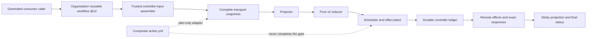

# Codex Review Gate v2 Design

语言：[British English (en-GB)](DESIGN.md) | [简体中文 (zh-CN)](DESIGN.zh-CN.md)

## 目标和 activation 状态

V2 把一份 sealed Codex provider-evidence snapshot 归并为 closed decision，再由 trusted
controller 按 durable order 执行已授权的 request、status 和 sticky-projection effect。
公开 status context 是 `codex/github-review-gate`。

公开 trust boundary 是 organization reusable workflow：

```yaml
uses: Joey-Tools/codex-review-gate-action/.github/workflows/codex-review-gate.yml@v2
```

`@v2` 是指向 immutable signed v2 commit 的 release alias。Called job materialize 精确
selected workflow repository/object。这是 compatible-major 的集中式委托，不允许执行
consumer repository 中的任意 code。

Production activation 仍为 blocked。Trusted production controller-input assembler、
durable scheduled dispatcher 与 automatic effect protocol 已实现并通过本地门禁；
publication admission 和 live activation proof 仍是 P0 前置条件。因此当前 package
记录的是完整 local implementation boundary，不提供 supported required-check rollout。
缺少 release、environment、server-time 或 canary evidence 时必须 fail closed。

## 架构



Production assembler 把每个 trusted event、scan、observation boundary 和 durable
history 转换成精确 controller command。Package-local reconcile workflow 只是这个
形状的 template/contract fixture，不是 hosted central router，也不是 activation evidence。

## Trust boundary

### Consumer boundary

Consumer 只拥有 generated caller、permission ceiling 和 organization `@v2` call。
Called workflow 不能提升 `GITHUB_TOKEN`。Consumer PR code、checkout file 和
caller-supplied arbitrary JSON 不是 trusted controller input。

### Release boundary

Release pipeline 把完整 `packages/action` subtree 发布到
`Joey-Tools/codex-review-gate-action`。个人 `JoeyTeng/codex-review-gate-action`
repository 是 frozen v1 archive；v2 documentation、runtime identity 和 release alias
绝不选择它。

Selected reusable workflow checkout：

- `repository: ${{ job.workflow_repository }}`
- `ref: ${{ job.workflow_sha }}`
- `persist-credentials: false`

精确 selected object 是该 invocation 的 runtime source。Floating major alias 允许
compatible v2 release；immutable release commit 和 signed tag 来自 release policy，
不是 caller claim。

### Controller boundary

Trusted controller 拥有：

- canonical input construction 和 state reconstruction；
- complete read transport 和 bounded final reread；
- durable request reservation 和 effect ledger persistence；
- effect ordering 和 retry-zero enforcement；
- response validation/binding；
- sticky projection 和 commit-status publication；
- server-time-bound wait transition。

Reducer 和 plan adapter 无法自行获得这些 capability。

### Provider-evidence boundary

Event 和 wakeup hint 只是 observation trigger。Request comment、terminal provider
artefact、finding、reaction、thread state、no-start response 和 lifecycle data 只有经过
complete transport、closed-schema projection 和 stability check 后才可使用。Commit
status、generic bot creator、sticky comment、scheduler deadline 或 prior decision 都不是
provider evidence。

## Plan-only composite adapter

`action.yml` 执行 `src/v2/action.mjs`。它接受 `RUNNER_TEMP` 下的 operation input path，
将读取限制在选定的 `RUNNER_TEMP` directory object 而非 checkout/PR-controlled path，
执行 read-only transport，再返回 closed plan。

在 Linux 和 macOS 上，reader 会持续持有选定的 `RUNNER_TEMP` directory descriptor，
并由一个隔离 child 从 `/` 开始遍历。每个 directory component 都先以 no-follow 方式
打开，在 `chdir` 期间保持 descriptor，再按 device、inode 和 file type 比较后继续；
leaf 则由 parent 以 nonblocking、no-follow 方式打开并作为 inherited descriptor 4 持续持有。
Child 只读取该 selected descriptor，并在两次 positioned read 前后要求 relative leaf 的
device、inode、file type、access policy 和 selected size 均一致；stable bytes 还必须是
strict UTF-8 和唯一 canonical JSON representation。该机制防止读取被重定向到不同
directory 或 leaf object；它不证明 producer provenance，也不证明 race 中解析到相同对象的
symlink 从未被短暂遍历。它还假定攻击者不能控制 privileged bind mount、mount namespace
或 filesystem identity semantics；这些场景需要 native mount-aware API。其他平台会 fail closed。

每次观测 leaf stat 时，access-policy predicate 都严格限定为：regular file、link count 为一，
且 POSIX group/other write mode bit 均未设置。它不检查 extended ACL，也不证明能够防御
same-UID writer、owner provenance 或 privileged mount authority；这些不属于固定 Ubuntu
production threat model。

Operations 是 `prepare-request`、`bind-request`、`evaluate-only`；必填且无默认值的
status target enum 是 `head` 或 `test-merge-with-head-sentinel`。`head` 只授权
non-success sentinel write；clean/skipped status publication 会显式 suppressed。所有
terminal verdict 只能发布到 validated potential merge。Joey-Tools production reusable
workflow 硬编码 `test-merge-with-head-sentinel`，不暴露 selector。

Adapter 会拒绝 non-read GitHub transport，也拒绝任何声称已经 performed write 的 runner
result。它不会：

- 创建 `@codex review` comment；
- 写 pending、success、failure 或 error status；
- 持久化 scheduler intent 或 effect ledger；
- 把 remote response 绑定为 executed effect；
- 执行 environment wait；
- 发布 sticky state projection；
- 完成 branch protection。

所以 direct composite（包括 exact-SHA invocation）只适合 controller development。
Plan file 不是 effect receipt。消费这些 plan 的 controller 必须独立保持 closed schema、
durability、ordering、idempotency 和 response-binding contract。

## Projection 和 reduction

Projector 把 immutable discovery/exact-evidence snapshot 与 explicit controller state
结合，绑定 repository、PR、base、head、unique merge base、potential merge
commit/tree/parents、lifecycle、selection、server enforcement、request、provider artefact、
thread resolution、acknowledgement、no-start observation 和 inventory completeness。

Selection 只能来自 explicit v2 controller intent 或 compatible v2 server enforcement。
不存在通过 filesystem、tag name、legacy file 或 decision table heuristic 选择 policy major
的路径。

Reducer 是 pure function：没有 I/O、clock 或 environment dependency。它只接受 closed
schema，并返回以下之一：

- `not-selected`
- `pending`
- `clean`
- `findings`
- `inconclusive`
- `skipped-unavailable`
- `blocked-configuration`
- `blocked-input`

关键 precedence rules：

1. Disabled 或 ineligible v2 selection 是 `not-selected`。
2. Invalid/currently unbound review epoch 是 `blocked-input`。
3. 缺少 compatible workflow/ruleset/App enforcement 是
   `blocked-configuration`。
4. Trustworthy blocking finding 是 `findings`，即使其他 inventory 不完整。
5. Unstable scope、不完整 pagination/final reread、malformed/unstable evidence 或 exhausted
   request authority 是 `inconclusive`。
6. Confirmed no-start response 只有在 implicit selection 下才是
   `skipped-unavailable`；explicitly requested route 应 blocked。
7. `clean` 要求 complete stable evidence 以及 accepted closed reaction basis。Terminal
   clean 只分类 provider artifact，不提供 positive completion authority。
8. 其他 selected current epoch 保持 `pending`。

Positive completion 刻意比 negative evidence 更严格。Trustworthy carrier 中的 finding
即使无关 acquisition 不完整也可以阻断；partial snapshot 永远不能得到 clean。

Reaction-only clean 选择 unique latest eligible request 及其 exact-provider `+1`。语义
时间相同或更晚的 exact-provider `eyes` 会否决这个 reaction-only 结果；更早的 `eyes`
不会。Reaction 永远不能覆盖已选择的 terminal payload，包括 `mixed` profile。

## Review epoch 和 status target

一个 v2 review epoch 绑定 repository/PR identity 以及精确 base、head、merge base 和有序
potential-merge data。Lifecycle 必须保持 open。Positive completion 前，initial/final
scope projection 必须一致。

Request quota 与 automatic generation continuity 在 base retarget 后仍按 head 计量，
因此旧 generation 不会被隐藏或退款。Positive `+1` 和 no-start authority 更窄：它们必须
绑定 head 范围内最新 admitted generation，而且该 request 还必须匹配当前 base 与 head。
Earlier-base request 可以支持下一次 recovery generation 或保留 negative finding history，
但 test-merge input 改变后不能授权当前 review epoch。稳定的 current-head terminal clean
仍可分类已发布 artifact，但当前 accepted provider schema 不会把 carrier 绑定到 request、
run 或 input base。

Durable controller history 有意分区。只有 `automatic-request-reservation` intent 与
`review-request`、`request-binding`、`artifact-binding`、`scheduler-state` response 会在
同 PR、同 head 的 base 或 potential-merge retarget 后保留。Status/sentinel binding、
no-start/thread-resolution observation 以及 control/sticky-comment binding 仍必须匹配
exact current scope，而且只能从 current incarnation 读取：即同 head 最后一个异 scope
durable record 之后的 exact-scope suffix。这样 A-to-B-to-A retarget 不会复活 A 的旧
scheduler、status、sentinel、no-start 或 comment authority。保留的 earlier-base history
只延续 budget、generation、retry-zero、recovery 与 negative findings，不能成为当前
positive authority。Automatic reservation 定义 generation origin；后续 review-request 与
request-binding 即使因同 head retarget 进入新的 exact scope，也只引用该 origin。Manual
request-binding 因没有 reservation 而定义自身 generation。Artifact-binding 和
scheduler-state record 同样只引用既有 origin，绝不能用自身 current operation scope
重新定义它。

Partial transaction 也遵守同一分区。尚未进入 retry-zero attempt 的 head-scoped
reservation 在 retarget 后继续占用额度，但恢复出的 attempt 与 request binding 必须绑定新
exact scope 及其 scheduler observation。尚未应答的 artifact-binding intent 只属于 exact
current scope 与 current incarnation：旧 scope intent，或被 durable foreign-scope record
隔开的同一 exact tuple 的更早 intent，都会被隔离，不会与 current candidate 比较或重放。
稳定的 incarnation anchor 是最新同 head foreign-scope durable record；它参与 effect
identity，而同一 incarnation 内的 crash 或 lease 变化仍恢复同一 transaction。

Control-plane audit receipt 当前为 schema version 2。Serialized validator 仍为 audit
compatibility 接受 exact closed legacy version-1 shape，但反序列化绝不会重建
process-local authority handle。Version 2 用 `current_incarnation` 标记 request binding，
要求所有 true marker 构成一个 ledger suffix，并把每个 current binding join 到其 exact
current generation。较早 head 的 visible request comment 仍必须有 durable audit binding，
但会从 exact selector、projected request 和 reaction 中过滤；visible current-head request
缺少 binding 时 fail closed。

Legacy version-1 receipt 保留原始 request-binding 上限：3 条 automatic 加 64 条 manual。
Sticky schema-version-1 projection 只为 audit/continuation compatibility 识别精确历史
`terminal-clean`、`terminal-findings`、`malformed-evidence` 与
`unresolved-inline-finding` whole-PR scope profile；current snapshot 仍必须使用当前 scope
assurance。

如果 addressed command 唯一指向一个经过 exact refetch、closed-provider 校验，但仅因属于
较早 head 而被过滤的 finding carrier，则该命令只属于历史并被忽略。Unknown target、
non-canonical 或错误绑定 URL、ambiguous carrier 以及无效 current-head target 仍 fail closed。
同样，较早 incarnation 的 provider reaction 或发生在 selected current request 之前的
reaction 不会压制有效 current no-start；只有绑定该 selected request 且发生于 request time
同时或之后的 exact-provider activity 才能否决 no-start。

Serialized receipt 保留 record OID、payload digest、response time 和其他 audit pointer。
Generic projector surface 只暴露 closed receipt 可独立 join 的字段，或 branded live-ledger
path 已授权的字段；对于仅靠反序列化 manifest digest 无法独立重新验证的 source-row
pointer，则刻意不暴露。只有当 receipt 同时证明 prior binding、recovery transition 和 next
binding 的顺序与 identity 时，closed generation admission 才携带相应指针。

只有 control-comment create/update history 不算 prior runner scheduling state。这样的
comment-only predecessor 之后，第一次 scheduler observation 仍必须使用 same-load initial
runner authority；该 observation 及其 status transaction 完成后，后续 scheduling 必须使用
established authority。

稳定、经过 final reread 的 current-head terminal clean 只用于分类。它产生
`inconclusive`，provider profile 为 `terminal-payload`（或 `mixed`），并携带精确
`artifact-publication-only` artifact basis；selected request、generation 与 recovery 均为
null，reaction 也不能覆盖 terminal classification。Runner 不暴露 terminal-clean binding
candidate，ledger 不接纳新的 terminal-clean completion transaction，projector 也不为该
carrier 制造 request lineage。Exact rich carrier commitment 仍用于 findings 与 audit
integrity，legacy two-field binding 仍只适用于 findings。

相反，完成 positive authority 的 current-request reaction 必须绑定 selected request，且
selected artifact 必须为 null。非 null finding-recovery receipt 只允许出现在该 reaction
basis 上。Stable input blocker 只映射到 `blocked-input`，不能制造
`blocked-configuration`。

Finding recovery 更严格：prior finding 被证明 closed，且因果上更晚的 current request
generation admitted 后，只有该 current request 上更晚的 reaction 才能完成 clean。
Terminal-clean carrier 不能提供或替代这个 recovery step。Automatic quota 耗尽时，完成
request 可以是 manual generation；automatic-to-automatic recovery 仍要求严格递增的 closed
generation chain。

因此 ledger candidate-authority compatibility boundary 始终是 findings-only：schema
version 1 只为 automatic generation 1 和 2 的 `finding-recovery` / `findings` 保留原始 byte
与 digest identity；任何版本都不能把没有认证 lineage 的 terminal clean 变成 completion
authority。历史 terminal-clean-shaped record 只能用于 audit，不能继续事务或投影为
positive evidence。Closed parser 可以识别其字节，但 durable replay 会在 scheduler 或
generation lineage 可能授权之前拒绝 terminal-clean binding purpose。

Pre-activation B boundary 仍使 production effects 当前不可达。本地证明组合真实 runner、
protected ledger transaction、fresh control-plane receipt、projector、reducer 与 controller
ordering，但不会发明 positive terminal-clean route；它不是 activation evidence。

Primary terminal policy 以 test-merge commit 为 target；需要时 controller 也写 head
sentinel，避免 stale/mismatched merge result 静默满足 head-only rule。Target choice 是
closed scheduler mode，不是 consumer-defined SHA。没有 validated potential merge 时，
`not-selected` 与 configuration-blocked 结果保留 null primary target；不会用 head commit
冒充缺失的 test-merge target。

Commit Status 仍按 repository SHA/context 建索引。它不是 cryptographic attestation、
provider artefact 或 PR-isolation proof。V2 依赖 controller receipt、exact epoch binding、
complete provider reduction 和 final reread，而不是只看 creator/context 外观。

## Scheduling 和 public wait

Scheduler 在不 sleep、不执行 I/O 的情况下计算 effect，返回 closed action、`due-at` 和
`wakeup-hints`；这些只是 advisory scheduling state，绝不是 evidence 或 verdict。

Repository schedule 使用独立的 durable dispatch protocol。Coordinator 完成或恢复
protected candidate inventory，证明整个 cycle 的 record/byte budget，持久化唯一 active
reservation，然后才投影最多 64 个 canonical matrix rows。Scheduled rows 串行执行，
且必须提交原始 dispatch binding。Ledger 对每个 candidate 强制 one-attempt，在 ack 前
要求完整 acquire/effect/release authority，并记录 batch/cycle completion。Restart 只补齐
partial bookkeeping 或暴露 typed recovery state，绝不会再次列出已 attempt 的 candidate。

Public route 要求三个独立 15 分钟 environment boundary：

- `codex-review-gate-public-initial-15m`
- `codex-review-gate-public-post-request-15m`
- `codex-review-gate-public-no-start-15m`

每个 environment 必须配置精确 15 分钟 wait-timer protection rule；name 本身没有
assurance。Trusted API preflight 和 live canary 必须证明 rule；controller 还必须校验
server-time observation，让 early release 无法 authorize effect。Shell sleep、delayed cron
或立即 workflow rerun 都不等价。

Manual dispatch 是 `evaluate-only`：可以 evaluate，但不能 request review 或 publish
status。Provider event 只是重建 snapshot 的 hint，不直接携带 trusted decision。

## Durable effect ordering

Controller effect ledger scope 是 repository、PR 和 head。每个 effect 有 identity 与
idempotency key，并遵循 persist-before-effect protocol。

Review request 顺序：

1. reserve scheduler request；
2. 完成 exact safe pre-scope read；
3. persist pre-effect attempt；
4. persist retry-zero request intent；
5. perform exactly one request POST；
6. bind exact 201 response；
7. rebuild/reduce subsequent snapshot；
8. 只 publish controller-authorised status/sticky effect。

有 ambiguous response 的 attempted effect 绝不 reclaim 或 replay。Pre-scope read failure
不会留下 pre-effect attempt 或 retry-zero request intent，因此保持可重试且不会声称 POST
已发生。后续 invocation 可以复用 already-bound response，但不能为同一 idempotency key
创建第二个 effect。Status 和 sticky effect 遵循同样的 reserve、persist、perform、bind
discipline。

Trusted server-time 顺序为 `pre-scope <= pre-effect attempt <= retry-zero request intent <=
request created_at <= POST response <= exact refetch <= post-scope`。Request-intent boundary
证明公开 POST 之前已经完成 write-ahead persistence；不能反过来把它当作更早 pre-scope
observation 的下界。

这提供 durable causal ordering，不是 distributed atomicity。如果无法证明 persistence
或 response binding，controller 必须 closed stop，并保留 ledger 供 recovery。

## Server enforcement 和 activation

只有 trusted controller 以及 required server-side workflow/ruleset/App binding compatible
时，v2 selection 才有意义。Reducer 通过 selection/server-enforcement status 明确表示
这种区别，而不是从某 branch 上存在 workflow file 推断 readiness。

Production activation 要求以下 property 同时成立：

- admitted release 包含已 review 的 assembler、durable dispatch 与 effect protocol，且与
  已通过本地门禁的 tree 一致；
- organization reusable workflow `@v2` 是 selected public entry；
- 所有 environment wait rule 通过 trusted API preflight；
- live canary 证明 wait 和 server-time enforcement；
- controller concurrency 和 durable ledger scope 正确；
- exact status target/sentinel behaviour 已证明；
- final snapshot/effect receipt 通过 terminal write 保持稳定；
- 只有此后才把 `codex/github-review-gate` 加入 ruleset。

在此之前，supported state 是 pre-activation validation。Copied caller、package-local
reconcile fixture、green adapter run 或 locally constructed controller JSON 都无法满足
activation gate。

## Major isolation 和 retained v1 artefact

Release tree 保留 v1 implementation/decision document，以保存 history 和 frozen archive：

- `src/core.mjs`、`src/gate.mjs` 是 legacy v1 runtime file；
- `decision-table.json` 只继续对 v1 policy major 1 有 authority；
- `producer-receipt.schema.json` 描述 legacy producer receipt v1；
- personal-repository `@v1` reference 仍是 frozen v1 consumer。

这些文件在 v2 中刻意 unselected。V2 projector、reducer、scheduler、plan adapter 和
workflow controller 只 import 自己的 `src/v2` module/closed schema。V2 controller 没有
option、environment variable、tag fallback、error recovery 或 compatibility route 可以
选择 v1 reducer。V2 failure 只能保持 `blocked-*`、`inconclusive` 或其他 closed v2
outcome。

Organization v2 target 不得暴露任何 `v1*` branch/tag selector。Split history 中存在 file
不会产生 selection authority。这样的 major-isolated retention 保留 audit/archive
continuity，但不会把 v1 变成 downgrade path。

## Security non-guarantees

V2 不声称：

- floating major alias 是 post-run immutable provenance；
- `github-actions[bot]` 能证明执行了哪份 workflow code；
- commit status 本身能证明 provider evidence 或 PR isolation；
- environment name 能证明 protection rule；
- composite adapter 已执行 plan；
- plan/result digest 是 signature 或 remote-effect receipt；
- 一次 point-in-time reread 消除所有 TOCTOU risk；
- retained v1 file 可被 v2 选择。

设计实际依赖 explicit release selection、closed schema、complete snapshot、stable reread、
durable effect identity、response binding 和 fail-closed activation evidence。
